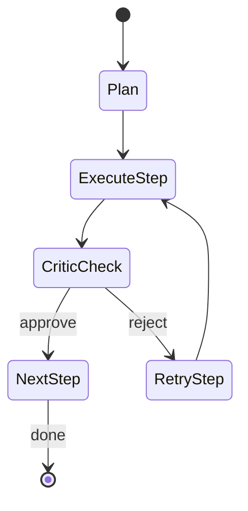

# ARCHITECTURE.md

## 1. Назначение
Проект реализует **vendor-agnostic LLM advisor strategy system**: архитектуру planner–executor с опциональным critic loop. Система должна быть:
- независимой от конкретных провайдеров/SDK (OpenAI, Anthropic/Claude и т.д.),
- конфигурируемой через YAML,
- управляемой через CLI,
- надежной (retry, логирование),
- трассируемой (SQLite persistence артефактов).

---

## 2. Workflow: Planner → Executors → Critic

```mermaid
flowchart TD
  U[User Input] --> P[Planner LLM]
  P -->|Plan (JSON)| O[Orchestrator]

  O --> R{Router<br/>(keywords)}
  R --> GE[GenericExecutor]
  R --> CE[CodeExecutor]

  GE --> SR1[StepResult]
  CE --> SR2[StepResult]

  SR1 --> C[Critic (optional)]
  SR2 --> C

  C -->|approve| NX[Next Step / Final]
  C -->|reject| RT[Retry same step<br/>with other executor/model]

  RT --> R
  NX --> F[Final Answer]
```
Основной поток выполнения:
User Input
↓
Planner (Advisor LLM) -> возвращает структурированный Plan (JSON)
↓
Для каждого шага плана:
Router выбирает executor (сначала по ключевым словам)
↓
Executor выполняет шаг -> возвращает StepResult
↓
(Опционально) Critic проверяет -> возвращает Critique
↓
если reject:
retry этого же шага с альтернативным executor/model (без перепланирования)
↓
Final Answer

Ключевое правило: **если critic недоволен — не перепланировать сразу**. Сначала повторить шаг с другим исполнителем/моделью согласно политике.

---

## 3. Независимость от vendor SDK (Vendor / SDK Agnosticism)

### 3.1 Внутренний нейтральный интерфейс
Весь прикладной код (агенты, orchestrator, router) зависит только от наших внутренних типов и интерфейсов:
- `Message` (role/content) как формат сообщений
- `ChatRequest` / `ChatResponse` как нейтральные request/response
- `LLMClient` как минимальный интерфейс (Protocol) для чата

Важно: код агентов/оркестрации **не импортирует** SDK провайдеров (`openai`, `anthropic` и т.п.).

### 3.2 Adapter layer (провайдер-специфичный слой)
Конкретные SDK изолируются за адаптерами, которые реализуют `LLMClient`.

Концептуально:
[Agents/Orchestrator] -> (LLMClient) -> [Adapter] -> [Vendor SDK / HTTP API]

Примеры адаптеров:
- `LiteLLMProxyAdapter` (OpenAI-compatible Messages API endpoint)
- `AnthropicAdapter` (Claude SDK / Messages API)
- `LocalModelAdapter` (vLLM/Ollama/etc.)

Ответственность адаптера:
- преобразовать нейтральные `Message[]` в формат провайдера,
- применить vendor-specific настройки,
- нормализовать ответ обратно в `ChatResponse`,
- (позже) привести tools/function calling к каноничному внутреннему формату.

Такой дизайн позволяет добавлять нового провайдера “одним модулем”, не меняя orchestration.

---

## 4. “Anthropic-style discipline” без излишней сложности

### 4.1 Структурированные данные между компонентами (всегда)
Внутри системы обмен между агентами/оркестратором идет через **типизированные структуры** (Pydantic) — это наш внутренний контракт и база надежности.
Примеры артефактов:
- `Plan`
- `PlanStep`
- `StepResult`
- `Critique`

Эти объекты сериализуются в JSON и сохраняются в SQLite.

### 4.2 Структурирование входа LLM (на уровне текста)
Чтобы бороться с “lost in the middle”, вход в LLM формируется “документом”:

Вход LLM формируется так, чтобы важное было в начале и было разделено заголовками:

Key Findings / Summary — в начале
Явные секции (Request, Constraints, Artifacts, Output format)
Это vendor-agnostic (обычный текст/Markdown).

### 4.3 Строго структурированный output — только там, где нужно
Planner: строгий JSON (валидируем Pydantic)
Critic: структурированный verdict (валидируем Pydantic)
Executor: обычно свободный текст, структура — по необходимости

Чтобы не усложнять систему:
- **Planner output**: строго JSON по схеме `Plan`, валидируем Pydantic.
- **Critic output**: структурированный verdict (`approved: bool`, `feedback: str`), валидируем Pydantic.
- **Executor output**: обычно свободный текст (опционально структурированные поля при необходимости).

Если парсинг/валидация ломается, применяется retry/repair (на следующих этапах).

---

## 5. Конфигурация

### 5.1 Выбор окружения (`--env`)
Среда выбирается CLI флагом:
- `--env dev|prod|test`

Среда влияет на:
- директорию конфигов: `config/<env>/...`
- выбор LLM реализации:
  - `test` использует `MockLLMClient` (детерминированно, без сети)
  - `dev/prod` используют реальные адаптеры (позже)

### 5.2 YAML конфиги: что храним и почему
Мы **не дублируем** конфигурацию LiteLLM (api_base, api_key, model_list). Это ответственность LiteLLM.

Наши YAML хранят только то, что нужно приложению.

**`models.yaml`**
- маппинг внутренних ролей на alias моделей LiteLLM (primary/fallback)
- цель: быстро переключать модели по ролям и по окружениям без изменения кода

Концептуально:

[Agents/Orchestrator] -> (LLMClient) -> [Adapter] -> [Vendor SDK / HTTP API]

Примеры адаптеров:
- `LiteLLMProxyAdapter` (OpenAI-compatible Messages API endpoint)
- `AnthropicAdapter` (Claude SDK / Messages API)
- `LocalModelAdapter` (vLLM/Ollama/etc.)

Ответственность адаптера:
- преобразовать нейтральные `Message[]` в формат провайдера,
- применить vendor-specific настройки,
- нормализовать ответ обратно в `ChatResponse`,
- (позже) привести tools/function calling к каноничному внутреннему формату.

Такой дизайн позволяет добавлять нового провайдера “одним модулем”, не меняя orchestration.

---

## 6. Persistence (SQLite)
Используем SQLite для хранения **артефактов**, не полного сырого транскрипта.

Что сохраняем (MVP):
- метаданные run (env, время)
- plan (JSON)
- step inputs/outputs (JSON или текст)
- critic verdict/feedback (JSON)
- final answer
- опционально usage/cost метаданные (если доступны)

Почему так:
- база не раздувается,
- меньше риск хранения чувствительных данных,
- меньше привязки к формату конкретного провайдера.

Опционально позже: trace-mode, чтобы сохранять raw messages для дебага.

---

## 7. Логирование
Используется стандартный `logging`:
- dev → DEBUG
- prod → INFO
- формат логов включает filename и line number для удобного дебага

Пока логирование только в консоль (по умолчанию stderr). Файл-лог можно добавить позже.
Настройки логирования тоже позже будут из файла конфигурации для env.

---

## 8. Надежность и retry (планируемая политика)
Retry применяем для:
1) транспортных ошибок (timeouts, rate limits, transient)
2) ошибок качества/валидации (critic reject, невалидный JSON planner/critic)

Ключевая политика:
- critic reject → retry того же шага с альтернативным executor/model
- перепланирование — fallback, не дефолт

Для retry используется `tenacity`.


---

## 9. Тестирование
- `--env test` + `MockLLMClient` + `config/test/...` дают детерминированные тесты без сети
- unit tests для конфигов/валидации/роутинга
- integration smoke tests для запуска CLI в test env