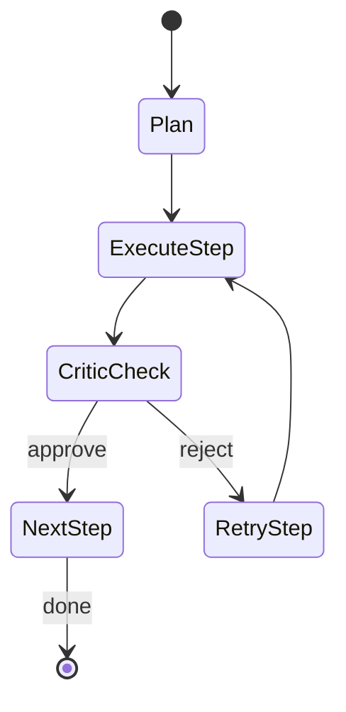

# ARCHITECTURE.md

## 0. Design Principles

Архитектура advisor'а опирается на 6 явных принципов, которые служат критерием при code review и архитектурных решениях:

- **KISS** — ядро оркестратора делает одно: запускает flow. Всё остальное (retry, persistence, метрики) — за пределами ядра, через hooks.
- **Vendor neutrality** — прикладной код (agents, orchestrator) не импортирует SDK провайдеров (`openai`, `anthropic`). Взаимодействие только через internal types и `LLMClient`.
- **Structured artifacts between components** — между компонентами ходят типизированные Pydantic-объекты, не строки.
- **Fail-safe для cross-cutting concerns** — сбой persistence / metrics / logging не валит run. Сбой planner/executor — валит. Разграничить обязательные компоненты от best-effort.
- **Explicit over implicit** — retry-политики, routing, конфиг прописаны явно, не через "магию".
- **SOLID** — single responsibility между ролями агентов, open/closed через hooks, dependency inversion через `LLMClient` и `RunStore`.

---

## 1. Назначение
Проект реализует **vendor-agnostic LLM advisor strategy system**: архитектуру planner–executor с опциональным critic loop. Система должна быть:
- независимой от конкретных провайдеров/SDK (OpenAI, Anthropic/Claude и т.д.),
- конфигурируемой через YAML,
- управляемой через CLI,
- надежной (retry, логирование),
- трассируемой (SQLite persistence артефактов).

---

## 2. Workflow: Planner → Executors → Critic (MVP Flow)

**Важно:** Planner-Executor-Critic — это **MVP default flow**, один из возможных паттернов мультиагентного исполнения. Система спроектирована так, чтобы flow был сменяемой стратегией, а не зашитой логикой. Альтернативные flows (Hub-and-Spoke, ReAct, Reflection) могут быть добавлены без изменений ядра оркестратора — см. раздел "Future Extensions".

```mermaid
flowchart TD
  U[User Input] --> P[Planner LLM]
  P -->|Plan (JSON)| O[Orchestrator]

  O --> R{Router<br/>(keywords)}
  R --> GE[GenericExecutor]
  R --> CE[CodeExecutor]

  GE --> SR1[StepResult]
  CE --> SR2[StepResult]

  SR1 --> C[Critic (optional)]
  SR2 --> C

  C -->|approve| NX[Next Step / Final]
  C -->|reject| RT[Retry same step<br/>with other executor/model]

  RT --> R
  NX --> F[Final Answer]
```
Основной поток выполнения:
User Input
↓
Planner (Advisor LLM) -> возвращает структурированный Plan (JSON)
↓
Для каждого шага плана:
Router выбирает executor (сначала по ключевым словам)
↓
Executor выполняет шаг -> возвращает StepResult
↓
(Опционально) Critic проверяет -> возвращает Critique
↓
если reject:
retry этого же шага с альтернативным executor/model (без перепланирования)
↓
Final Answer

Ключевое правило: **если critic недоволен — не перепланировать сразу**. Сначала повторить шаг с другим исполнителем/моделью согласно политике.

---

## 2.5. RunContext — Shared Execution State

`RunContext` — единый объект, который создаётся при старте run'а и сопровождает всё выполнение: planner → executor(s) → critic → final answer. Это точка консолидации для state, persistence, hooks и retry-логики.

### Структура RunContext

- `run_id` — уникальный идентификатор run'а
- `env` — среда выполнения (dev/prod/test)
- `user_request` — исходный запрос пользователя (неизменный)
- `plan` — план, сгенерированный planner'ом (заполняется после планирования)
- `events` — append-only список событий (см. ниже)
- `retry_counters` — счётчики retry по step_id (для enforcement retry cap)
- `metadata` — extensibility dict для hooks (ключи — имена hooks, значения — любые данные)

### Модель событий (Events — append-only)

Каждое событие имеет тип, timestamp и payload:
- `plan_created` — plan сгенерирован
- `step_started` — executor начал работу над step'ом
- `step_completed` — executor вернул результат
- `tool_call` / `tool_result` — вызов tool и его результат
- `critic_verdict` — critic вернул approve/reject
- `step_rejected` — step отклонён, будет retry
- `step_retried` — retry step с другим executor/model
- `run_completed` — финальный ответ
- `error` — необработанная ошибка

### Почему append-only events?

- **Универсальность**: работает для любого flow (линейный / граф / hub-and-spoke) — flow интерпретирует события по-своему
- **Persistent foundation**: основа для DB-agnostic persistence (каждый event = одна запись)
- **Recovery**: восстановление run'а при сбое через replay событий
- **Fail-safe compatibility**: если persistence упал на событии N, события 1..N-1 уже сохранены

### Что НЕ хранит

RunContext не содержит raw transcripts LLM (уменьшает размер БД, снижает риски хранения PII). Артефакты хранятся как структурированные поля плана и результатов.

---

## 3. Независимость от vendor SDK (Vendor / SDK Agnosticism)

### 3.1 Внутренний нейтральный интерфейс
Весь прикладной код (агенты, orchestrator, router) зависит только от наших внутренних типов и интерфейсов:
- `Message` (role/content) как формат сообщений
- `ChatRequest` / `ChatResponse` как нейтральные request/response
- `LLMClient` как минимальный интерфейс (Protocol) для чата

Важно: код агентов/оркестрации **не импортирует** SDK провайдеров (`openai`, `anthropic` и т.п.).

### 3.2 Adapter layer (провайдер-специфичный слой)
Конкретные SDK изолируются за адаптерами, которые реализуют `LLMClient`.

Концептуально:
[Agents/Orchestrator] -> (LLMClient) -> [Adapter] -> [Vendor SDK / HTTP API]

Примеры адаптеров:
- `LiteLLMProxyAdapter` (OpenAI-compatible Messages API endpoint)
- `AnthropicAdapter` (Claude SDK / Messages API)
- `LocalModelAdapter` (vLLM/Ollama/etc.)

Ответственность адаптера:
- преобразовать нейтральные `Message[]` в формат провайдера,
- применить vendor-specific настройки,
- нормализовать ответ обратно в `ChatResponse`,
- (позже) привести tools/function calling к каноничному внутреннему формату.

Такой дизайн позволяет добавлять нового провайдера “одним модулем”, не меняя orchestration.

---

## 4. “Anthropic-style discipline” без излишней сложности

### 4.1 Структурированные данные между компонентами (всегда)
Внутри системы обмен между агентами/оркестратором идет через **типизированные структуры** (Pydantic) — это наш внутренний контракт и база надежности.
Примеры артефактов:
- `Plan`
- `PlanStep`
- `StepResult`
- `Critique`

Эти объекты сериализуются в JSON и сохраняются в SQLite.

### 4.2 Структурирование входа LLM (на уровне текста)
Чтобы бороться с “lost in the middle”, вход в LLM формируется “документом”:

Вход LLM формируется так, чтобы важное было в начале и было разделено заголовками:

Key Findings / Summary — в начале
Явные секции (Request, Constraints, Artifacts, Output format)
Это vendor-agnostic (обычный текст/Markdown).

### 4.3 Строго структурированный output — только там, где нужно
Planner: строгий JSON (валидируем Pydantic)
Critic: структурированный verdict (валидируем Pydantic)
Executor: обычно свободный текст, структура — по необходимости

Чтобы не усложнять систему:
- **Planner output**: строго JSON по схеме `Plan`, валидируем Pydantic.
- **Critic output**: структурированный verdict (`approved: bool`, `feedback: str`), валидируем Pydantic.
- **Executor output**: обычно свободный текст (опционально структурированные поля при необходимости).

Если парсинг/валидация ломается, применяется retry/repair (на следующих этапах).

---

## 5. Конфигурация

### 5.0 Иерархия источников конфигурации

Конфигурация собирается из нескольких источников с явным приоритетом (от наивысшего к низшему):

1. **CLI аргументы** — `--env`, `--model`, `--flow` и т.д.
2. **Переменные окружения** — `ADVISOR_*`
3. **Project-level config** — `.advisor/config.yaml` в директории проекта
4. **Global config** — `~/.advisor/config.yaml`
5. **Built-in defaults** — hardcoded в ConfigLoader

Каждый следующий уровень переопределяет предыдущий только для явно указанных ключей, не целиком. Это позволяет локальные переопределения (CLI) комбинировать с глобальными settings без дублирования.

### 5.1 Выбор окружения (`--env`)
Среда выбирается CLI флагом:
- `--env dev|prod|test`

Среда влияет на:
- директорию конфигов: `config/<env>/...`
- выбор LLM реализации:
  - `test` использует `MockLLMClient` (детерминированно, без сети)
  - `dev/prod` используют реальные адаптеры (позже)

### 5.2 YAML конфиги: что храним и почему
Мы **не дублируем** конфигурацию LiteLLM (api_base, api_key, model_list). Это ответственность LiteLLM.

Наши YAML хранят только то, что нужно приложению.

**`models.yaml`**
- маппинг внутренних ролей на alias моделей LiteLLM (primary/fallback)
- цель: быстро переключать модели по ролям и по окружениям без изменения кода

---

## 6. Persistence (DB-agnostic)

Хранение артефактов run'а реализуется через абстрактный интерфейс `RunStore`, не привязано к конкретной БД.

### 6.1 RunStore — абстрактный интерфейс

Весь persistence-код в ядре работает только через интерфейс `RunStore`. Минимальный набор операций:

- `save_run_metadata(run_id, metadata: dict)` — создать запись о run'е
- `append_event(run_id, event: RunEvent)` — добавить событие (append-only)
- `get_run(run_id)` → tuple[metadata, events] | None
- `list_runs(limit: int, env: str | None = None)` → list[metadata]

### 6.2 Реализации RunStore

- **SQLiteRunStore** — default для dev/prod, переиспользует инициализацию из Stage 0.2
- **InMemoryRunStore** — для тестов (нет disk I/O, детерминированно)
- Выбор backend'а через конфиг (`persistence.type: sqlite | in-memory`)
- В будущем: JSONL-файлы, PostgreSQL и т.д.

### 6.3 Модель хранения: metadata + append-only events

**Run metadata** (неизменная "шапка"):
- `run_id`, `env`, `user_request`, `started_at`, `completed_at`, `status`

**Run events** (append-only):
- Каждое событие = одна запись (см. раздел 2.5 RunContext)
- Разделение: metadata читается быстро; events растут инкрементально

**Почему append-only?**
- Работает для любого flow (система спроектирована с расчётом на future extensions)
- Основа для DB-agnostic persistence: каждый event = одна запись
- Восстановление run'а при сбое через replay событий
- Совместимо с fail-safe: если persistence упал на событии N, события 1..N-1 уже сохранены

### 6.4 Подключение к оркестратору

RunStore вызывается только через hooks (`after_step`, `on_run_complete`), не прямыми вызовами из ядра orchestrator'а. Это обеспечивает fail-safe: сбой persistence не валит основной flow.

---

## 7. Логирование
Используется стандартный `logging`:
- dev → DEBUG
- prod → INFO
- формат логов включает filename и line number для удобного дебага

Пока логирование только в консоль (по умолчанию stderr). Файл-лог можно добавить позже.
Настройки логирования тоже позже будут из файла конфигурации для env.

---

## 8. Надежность и retry (планируемая политика)

### 8.1 Error taxonomy — классификация ошибок

Retry-политика определяется типом ошибки. Иерархия ошибок:

- **TransportError** (timeout, 5xx, rate limit, connection refused) → exponential backoff, retryable
- **AuthError** (401, 403) → fail immediately, non-retryable (нет смысла retry)
- **ValidationError** (невалидный JSON от planner/critic) → repair-попытка с уточняющим промптом
- **ExecutorError** (сбой в исполнении шага) → retryable с другим executor/model через Router
- **CriticRejectError** (штатный reject от critic) → отдельный путь (Step 3.4): retry шага через Router без перепланирования

**Глобальный retry cap:**
- Максимум retry на один шаг: 2 (configurable)
- Максимум суммарных reject'ов за run: N (configurable) — защита от бесконечного цикла при хроническом reject
- При исчерпании → run завершается с `status=failed`, все артефакты сохранены

### 8.2 Применение retry-политик

Retry применяем для:
1) транспортных ошибок (timeouts, rate limits, transient)
2) ошибок качества/валидации (critic reject, невалидный JSON planner/critic)

Ключевая политика:
- critic reject → retry того же шага с альтернативным executor/model
- перепланирование — fallback, не дефолт

Для retry используется `tenacity`.



---

## 8.5. Extension Hooks

Оркестратор вызывает именованные hook-точки в ключевых местах pipeline. Hooks — это user-defined callable'ы, получающие `RunContext`.

### Именованные точки расширения

- `before_plan(ctx)` — перед вызовом planner
- `after_plan(ctx, plan)` — план получен, до первого шага
- `before_step(ctx, step)` — перед вызовом executor
- `after_step(ctx, step, result)` — после получения StepResult
- `on_critic_verdict(ctx, step, verdict)` — после получения verdict от critic
- `on_step_reject(ctx, step, verdict)` — при reject, до retry
- `on_run_complete(ctx, final_answer)` — run завершён
- `on_error(ctx, error)` — необработанная ошибка в pipeline

### Контракт hooks

- Hook получает `RunContext`, может читать и дополнять `metadata`
- Hook **не может** прерывать основной flow (не middleware-style short-circuit)
- Ошибка в hook'е: логируется, flow продолжается — **fail-safe** (аналогично Design Principles)
- Hooks регистрируются при инициализации, не хардкодятся в orchestrator

### Применение (примеры)

- **Persistence**: `after_step` + `on_run_complete` → `RunStore`
- **Debug logging**: `before_step` + `after_step` → структурированный лог шагов
- **Метрики**: `on_run_complete` → агрегация usage/cost из events

Hooks позволяют добавлять persistence, метрики, валидацию без правок ядра оркестратора. Это реализация open/closed principle на практике.

---

## 9. Тестирование
- `--env test` + `MockLLMClient` + `config/test/...` дают детерминированные тесты без сети
- unit tests для конфигов/валидации/роутинга
- integration smoke tests для запуска CLI в test env

---

## 10. Future Extensions

### 10.1 Flow abstraction (post-MVP)

Planner-Executor-Critic — один flow. Когда потребуется расширение, Flow вводится как абстракция со своим контрактом (участники, логика передачи управления, критерии завершения). Оркестратор становится "flow runner". 

Примеры будущих flows:
- **Hub-and-Spoke**: центральный координатор делегирует специализированным агентам, агрегирует ответы
- **ReAct**: один агент в цикле think→act→observe с tools
- **Reflection**: agent → self-critique → revision → repeat
- **Sequential chain**: `agent_A → agent_B → agent_C` без ветвлений

**Критерий правильной реализации:** добавление нового flow не требует изменений в ядре оркестратора, RunContext, persistence, hooks. Это валидация что система действительно расширяемая.

### 10.2 Agent-as-config

Роли (Planner, Executor, Critic) — это конфигурации агента (prompt + tools + model alias), а не классы-наследники. Это позволяет добавить новую роль (например, Hub или Spoke) только конфигом, без нового класса.

### 10.3 Tools layer

- **Tool interface**: name, description, parameter schema (JSON Schema), invoke callable
- **Tool registry**: глобальный реестр, агенты объявляют subset доступных tools
- **Vendor-agnostic schema**: adapter конвертирует в OpenAI functions / Anthropic tool_use при вызове
- **Security**: validation входов по schema, audit каждого call'а в RunContext events
- **MCP (Model Context Protocol)** как потенциальный стандарт для интеграции готовых tool-серверов